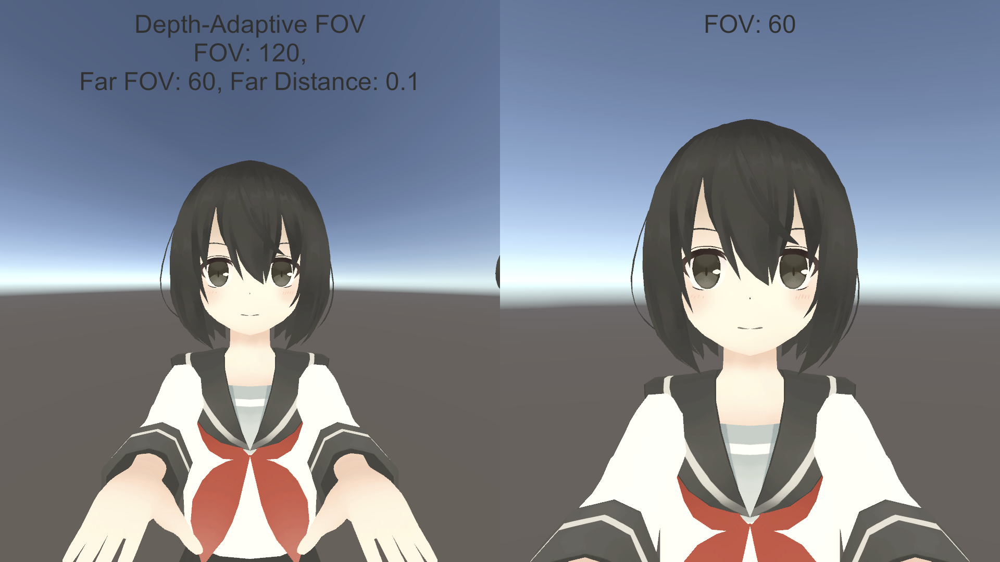
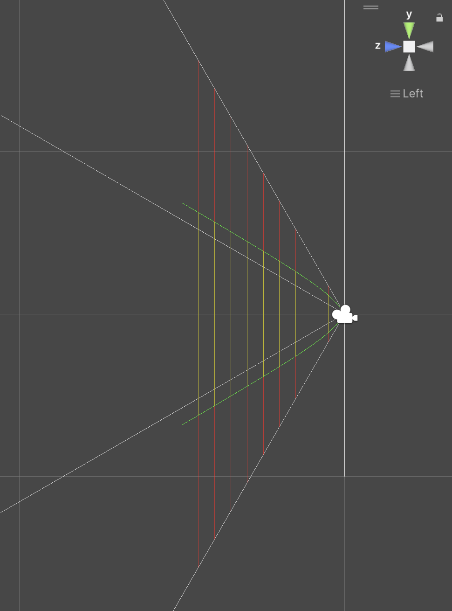

# Depth-Adaptive FOV

Depth-based non-linear perspective projection for Unity. Near objects use the camera's native FOV while far objects smoothly transition to a narrower FOV.

## Motivation

VR/AR avatar selfies need a wide FOV to match hand positions with arm length. But wide-angle distorts the face unnaturally. Depth-Adaptive FOV solves this by rendering hands at wide FOV and face at narrow FOV.


*Left: Depth-Adaptive FOV (Near: 120°, Far: 60°) / Right: Standard FOV 60°*

## Shaders

| Shader | Description | Install |
|--------|-------------|---------|
| `Custom/DepthFOVUnlit` | Basic unlit shader | Copy `Assets/DepthAdaptiveFOV/` |
| `VRM10/MToon10 DepthFOV` | VRM/MToon10 toon shader | UPM (see below) |

## Installation

### MToon10 Depth FOV (UPM)

Add to `Packages/manifest.json`:

```json
{
  "dependencies": {
    "com.neoneobeam.depth-adaptive-fov.mtoon10": "https://github.com/noir-neo/depth-adaptive-fov.git?path=Packages/com.neoneobeam.depth-adaptive-fov.mtoon10"
  }
}
```

**Requirements:** Unity 6000.0+, [UniVRM](https://github.com/vrm-c/UniVRM) >= 0.129.3

### DepthFOVUnlit (Manual)

Copy `Assets/DepthAdaptiveFOV/` to your project.

## Parameters

| Parameter | Description | Default |
|-----------|-------------|---------|
| `_FarFOV` | Target FOV at infinity (degrees) | 60 |
| `_FarDistance` | Distance for 50% interpolation (meters) | 1.0 |

Near FOV is taken from the camera's FOV setting.

## Algorithm

FOV interpolation uses an asymptotic curve:

```
t = depth / (depth + _FarDistance)
effectiveFOV = lerp(cameraFOV, _FarFOV, t)
```

- At `depth = 0`: camera FOV (t = 0)
- At `depth = _FarDistance`: halfway to far FOV (t = 0.5)
- At `depth = ∞`: far FOV (t → 1.0)

The vertex shader scales clip-space coordinates based on the per-vertex FOV ratio.

## Debug Visualization

Attach `DepthFOVGizmo.cs` to a Camera:

- **Yellow**: Depth-Adaptive FOV frustum
- **Red**: Standard perspective frustum



## Limitations

- Per-vertex calculation (large polygons may distort)
- Requires shader replacement per material

## License

MIT
